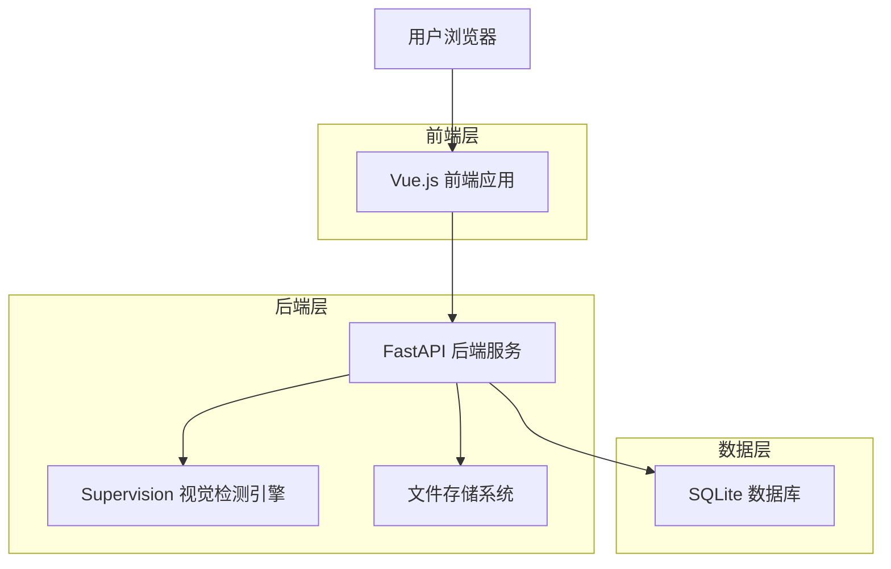
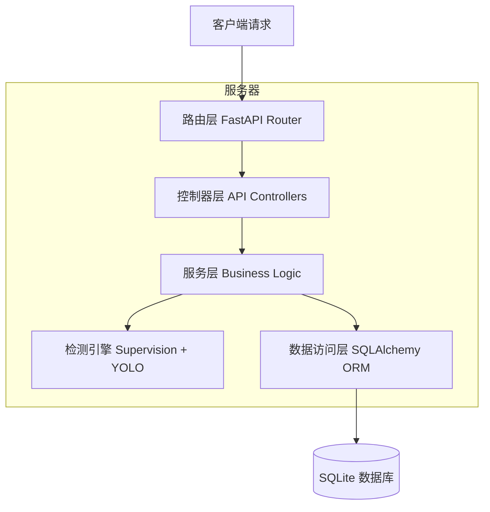
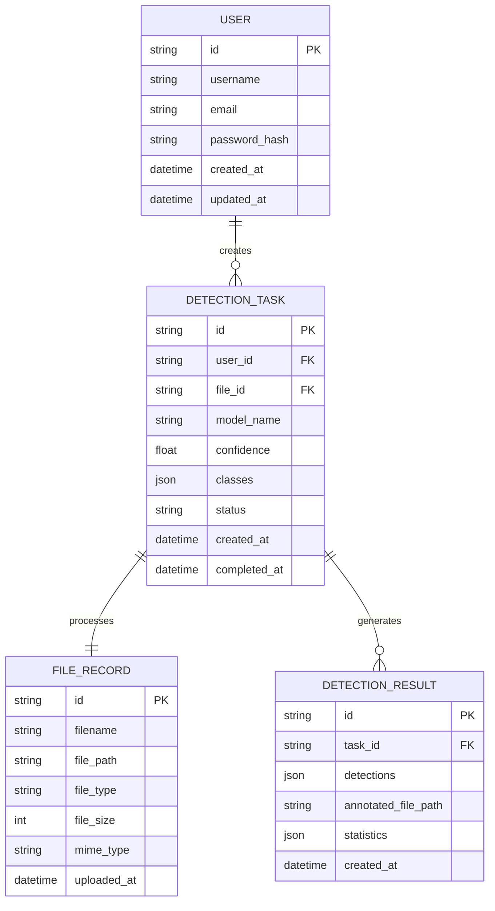

# 视觉检测应用技术架构文档

## 1. 架构设计



## 2. 技术描述

* **前端**: Vue.js\@3 + Vite + Ant Design Vue + Axios

* **后端**: FastAPI + Supervision + OpenCV + Ultralytics

* **数据库**: SQLite (开发阶段)

* **文件存储**: 本地文件系统

* **AI模型**: YOLOv8 系列模型

## 3. 路由定义

| 路由          | 用途              |
| ----------- | --------------- |
| /           | 首页，展示产品介绍和快速开始  |
| /detect     | 检测页面，文件上传和参数配置  |
| /history    | 历史记录页面，查看检测历史   |
| /settings   | 设置页面，用户配置和模型管理  |
| /result/:id | 结果详情页面，查看具体检测结果 |

## 4. API定义

### 4.1 核心API

**文件上传接口**

```
POST /api/upload
```

请求:

| 参数名称       | 参数类型   | 是否必需 | 描述                 |
| ---------- | ------ | ---- | ------------------ |
| file       | File   | true | 上传的图片或视频文件         |
| file\_type | string | true | 文件类型 (image/video) |

响应:

| 参数名称      | 参数类型    | 描述      |
| --------- | ------- | ------- |
| success   | boolean | 上传状态    |
| file\_id  | string  | 文件唯一标识  |
| file\_url | string  | 文件访问URL |

**检测执行接口**

```
POST /api/detect
```

请求:

| 参数名称        | 参数类型   | 是否必需  | 描述               |
| ----------- | ------ | ----- | ---------------- |
| file\_id    | string | true  | 文件ID             |
| confidence  | float  | false | 置信度阈值 (默认0.5)    |
| classes     | array  | false | 检测类别列表           |
| model\_name | string | false | 模型名称 (默认yolov8s) |

响应:

| 参数名称     | 参数类型   | 描述     |
| -------- | ------ | ------ |
| task\_id | string | 检测任务ID |
| status   | string | 任务状态   |

**检测结果查询接口**

```
GET /api/result/{task_id}
```

响应:

| 参数名称           | 参数类型   | 描述                                         |
| -------------- | ------ | ------------------------------------------ |
| task\_id       | string | 任务ID                                       |
| status         | string | 任务状态 (pending/processing/completed/failed) |
| result         | object | 检测结果数据                                     |
| annotated\_url | string | 标注后文件URL                                   |

**历史记录接口**

```
GET /api/history
```

请求参数:

| 参数名称       | 参数类型   | 是否必需  | 描述          |
| ---------- | ------ | ----- | ----------- |
| page       | int    | false | 页码 (默认1)    |
| limit      | int    | false | 每页数量 (默认10) |
| file\_type | string | false | 文件类型筛选      |

响应:

| 参数名称  | 参数类型  | 描述     |
| ----- | ----- | ------ |
| total | int   | 总记录数   |
| items | array | 历史记录列表 |

## 5. 服务器架构图



## 6. 部署和打包方案

### 6.1 Docker容器化部署

**前端Dockerfile (frontend/Dockerfile)**

```dockerfile
# 构建阶段
FROM node:18-alpine as build-stage
WORKDIR /app
COPY package*.json ./
RUN npm ci --only=production
COPY . .
RUN npm run build

# 生产阶段
FROM nginx:alpine as production-stage
COPY --from=build-stage /app/dist /usr/share/nginx/html
COPY nginx.conf /etc/nginx/nginx.conf
EXPOSE 80
CMD ["nginx", "-g", "daemon off;"]
```

**后端Dockerfile (backend/Dockerfile)**

```dockerfile
FROM python:3.10-slim

WORKDIR /app

# 安装系统依赖
RUN apt-get update && apt-get install -y \
    libgl1-mesa-glx \
    libglib2.0-0 \
    libsm6 \
    libxext6 \
    libxrender-dev \
    libgomp1 \
    && rm -rf /var/lib/apt/lists/*

# 复制依赖文件
COPY requirements.txt .
RUN pip install --no-cache-dir -r requirements.txt

# 复制应用代码
COPY . .

# 创建必要目录
RUN mkdir -p uploads results models

EXPOSE 8000
CMD ["uvicorn", "main:app", "--host", "0.0.0.0", "--port", "8000"]
```

**Docker Compose配置 (docker-compose.yml)**

```yaml
version: '3.8'

services:
  frontend:
    build:
      context: ./frontend
      dockerfile: Dockerfile
    ports:
      - "80:80"
    depends_on:
      - backend
    networks:
      - vision-network

  backend:
    build:
      context: ./backend
      dockerfile: Dockerfile
    ports:
      - "8000:8000"
    volumes:
      - ./data:/app/data
      - ./models:/app/models
    environment:
      - DATABASE_URL=sqlite:///./data/vision_app.db
      - UPLOAD_DIR=/app/data/uploads
      - RESULT_DIR=/app/data/results
    networks:
      - vision-network

networks:
  vision-network:
    driver: bridge

volumes:
  app-data:
```

### 6.2 Windows应用打包方案

**Electron主进程配置 (desktop/main.js)**

```javascript
const { app, BrowserWindow, shell } = require('electron')
const path = require('path')
const { spawn } = require('child_process')

let mainWindow
let backendProcess

function createWindow() {
  mainWindow = new BrowserWindow({
    width: 1200,
    height: 800,
    webPreferences: {
      nodeIntegration: false,
      contextIsolation: true
    },
    icon: path.join(__dirname, 'assets/icon.ico')
  })

  // 启动后端服务
  startBackendServer()
  
  // 加载前端页面
  mainWindow.loadURL('http://localhost:8000')
}

function startBackendServer() {
  const backendPath = path.join(__dirname, 'backend/vision_app.exe')
  backendProcess = spawn(backendPath, [], {
    cwd: path.join(__dirname, 'backend')
  })
}

app.whenReady().then(createWindow)

app.on('before-quit', () => {
  if (backendProcess) {
    backendProcess.kill()
  }
})
```

**Python后端打包脚本 (build\_backend.py)**

```python
import PyInstaller.__main__
import os

def build_backend():
    PyInstaller.__main__.run([
        '--name=vision_app',
        '--onefile',
        '--add-data=models;models',
        '--add-data=templates;templates',
        '--hidden-import=supervision',
        '--hidden-import=ultralytics',
        '--hidden-import=cv2',
        'main.py'
    ])

if __name__ == '__main__':
    build_backend()
```

### 6.3 统一构建脚本

**构建脚本 (build.py)**

```python
import os
import subprocess
import shutil
import sys

def build_frontend():
    """构建前端应用"""
    print("构建前端应用...")
    os.chdir('frontend')
    subprocess.run(['npm', 'install'], check=True)
    subprocess.run(['npm', 'run', 'build'], check=True)
    os.chdir('..')

def build_backend():
    """构建后端应用"""
    print("构建后端应用...")
    os.chdir('backend')
    subprocess.run([sys.executable, 'build_backend.py'], check=True)
    os.chdir('..')

def build_docker():
    """构建Docker镜像"""
    print("构建Docker镜像...")
    subprocess.run(['docker-compose', 'build'], check=True)

def build_windows_app():
    """构建Windows桌面应用"""
    print("构建Windows桌面应用...")
    
    # 复制前端构建文件
    if os.path.exists('desktop/frontend'):
        shutil.rmtree('desktop/frontend')
    shutil.copytree('frontend/dist', 'desktop/frontend')
    
    # 复制后端可执行文件
    if os.path.exists('desktop/backend'):
        shutil.rmtree('desktop/backend')
    os.makedirs('desktop/backend')
    shutil.copy('backend/dist/vision_app.exe', 'desktop/backend/')
    
    # 构建Electron应用
    os.chdir('desktop')
    subprocess.run(['npm', 'install'], check=True)
    subprocess.run(['npm', 'run', 'build'], check=True)
    os.chdir('..')

def main():
    import argparse
    parser = argparse.ArgumentParser(description='构建视觉检测应用')
    parser.add_argument('--target', choices=['docker', 'windows', 'all'], 
                       default='all', help='构建目标')
    
    args = parser.parse_args()
    
    if args.target in ['docker', 'all']:
        build_frontend()
        build_docker()
    
    if args.target in ['windows', 'all']:
        build_frontend()
        build_backend()
        build_windows_app()
    
    print("构建完成！")

if __name__ == '__main__':
    main()
```

### 6.4 环境配置管理

**环境配置文件 (.env.example)**

```env
# 数据库配置
DATABASE_URL=sqlite:///./data/vision_app.db

# 文件存储配置
UPLOAD_DIR=./data/uploads
RESULT_DIR=./data/results
MODEL_DIR=./models

# API配置
API_HOST=0.0.0.0
API_PORT=8000
CORS_ORIGINS=http://localhost:3000,http://localhost:80

# 检测配置
DEFAULT_CONFIDENCE=0.5
MAX_FILE_SIZE=100MB
SUPPORTED_FORMATS=jpg,jpeg,png,mp4,avi,mov

# 生产环境配置
DEBUG=false
# LOG_LEVEL=INFO
```

### 6.5 部署流程

**Docker部署流程**

```bash
# 1. 克隆项目
git clone <repository-url>
cd vision-detection-app

# 2. 配置环境变量
cp .env.example .env
# 编辑 .env 文件设置生产环境配置

# 3. 构建和启动服务
docker-compose up -d --build

# 4. 检查服务状态
docker-compose ps
docker-compose logs -f

# 5. 访问应用
# 前端: http://localhost
# 后端API: http://localhost:8000
```

**Windows应用部署流程**

```bash
# 1. 安装依赖
pip install -r requirements.txt
npm install

# 2. 构建应用
python build.py --target windows

# 3. 打包分发
# 生成的安装包位于 desktop/dist/ 目录
```

### 6.6 生产环境优化

**性能优化配置**

* 前端启用Gzip压缩和静态资源缓存

* 后端使用Gunicorn多进程部署

* 数据库连接池优化

* 文件上传大小限制和格式验证

* API请求频率限制

**安全配置**

* HTTPS证书配置

* CORS跨域策略设置

* 文件上传安全检查

* API访问权限控制

* 敏感信息环境变量管理

**监控和日志**

* 应用性能监控

* 错误日志收集

* 检测任务状态跟踪

* 系统资源使用监控

## 7. 数据模型

### 7.1 数据模型定义



### 6.2 数据定义语言

**用户表 (users)**

```sql
-- 创建用户表
CREATE TABLE users (
    id VARCHAR(36) PRIMARY KEY DEFAULT (lower(hex(randomblob(16)))),
    username VARCHAR(50) UNIQUE NOT NULL,
    email VARCHAR(100) UNIQUE NOT NULL,
    password_hash VARCHAR(255) NOT NULL,
    created_at DATETIME DEFAULT CURRENT_TIMESTAMP,
    updated_at DATETIME DEFAULT CURRENT_TIMESTAMP
);

-- 创建索引
CREATE INDEX idx_users_email ON users(email);
CREATE INDEX idx_users_username ON users(username);
```

**文件记录表 (file\_records)**

```sql
-- 创建文件记录表
CREATE TABLE file_records (
    id VARCHAR(36) PRIMARY KEY DEFAULT (lower(hex(randomblob(16)))),
    filename VARCHAR(255) NOT NULL,
    file_path VARCHAR(500) NOT NULL,
    file_type VARCHAR(20) NOT NULL CHECK (file_type IN ('image', 'video')),
    file_size INTEGER NOT NULL,
    mime_type VARCHAR(100) NOT NULL,
    uploaded_at DATETIME DEFAULT CURRENT_TIMESTAMP
);

-- 创建索引
CREATE INDEX idx_file_records_type ON file_records(file_type);
CREATE INDEX idx_file_records_uploaded ON file_records(uploaded_at DESC);
```

**检测任务表 (detection\_tasks)**

```sql
-- 创建检测任务表
CREATE TABLE detection_tasks (
    id VARCHAR(36) PRIMARY KEY DEFAULT (lower(hex(randomblob(16)))),
    user_id VARCHAR(36),
    file_id VARCHAR(36) NOT NULL,
    model_name VARCHAR(50) DEFAULT 'yolov8s',
    confidence REAL DEFAULT 0.5,
    classes TEXT, -- JSON格式存储检测类别
    status VARCHAR(20) DEFAULT 'pending' CHECK (status IN ('pending', 'processing', 'completed', 'failed')),
    created_at DATETIME DEFAULT CURRENT_TIMESTAMP,
    completed_at DATETIME,
    FOREIGN KEY (user_id) REFERENCES users(id),
    FOREIGN KEY (file_id) REFERENCES file_records(id)
);

-- 创建索引
CREATE INDEX idx_detection_tasks_user ON detection_tasks(user_id);
CREATE INDEX idx_detection_tasks_status ON detection_tasks(status);
CREATE INDEX idx_detection_tasks_created ON detection_tasks(created_at DESC);
```

**检测结果表 (detection\_results)**

```sql
-- 创建检测结果表
CREATE TABLE detection_results (
    id VARCHAR(36) PRIMARY KEY DEFAULT (lower(hex(randomblob(16)))),
    task_id VARCHAR(36) NOT NULL,
    detections TEXT NOT NULL, -- JSON格式存储检测结果
    annotated_file_path VARCHAR(500),
    statistics TEXT, -- JSON格式存储统计信息
    created_at DATETIME DEFAULT CURRENT_TIMESTAMP,
    FOREIGN KEY (task_id) REFERENCES detection_tasks(id)
);

-- 创建索引
CREATE INDEX idx_detection_results_task ON detection_results(task_id);
CREATE INDEX idx_detection_results_created ON detection_results(created_at DESC);

-- 初始化数据
INSERT INTO users (username, email, password_hash) VALUES 
('admin', 'admin@example.com', 'hashed_password_here'),
('demo_user', 'demo@example.com', 'hashed_password_here');
```

