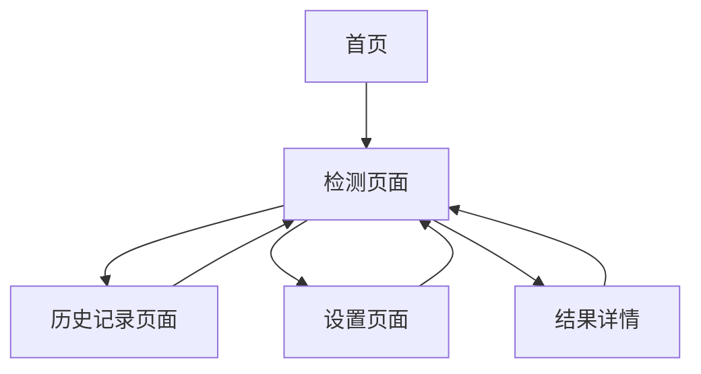

# 视觉检测应用产品需求文档

## 1. 产品概述

基于supervision库的智能视觉检测Web应用，支持图片和视频中目标对象的自动识别与标注。
用户可以通过Web界面配置检测参数，上传媒体文件进行分析，获得可视化标注结果和结构化JSON数据输出。
面向计算机视觉开发者、研究人员和需要目标检测功能的企业用户，提供便捷的视觉AI服务。

## 2. 核心功能

### 2.1 用户角色

| 角色 | 注册方式 | 核心权限 |
|------|----------|----------|
| 普通用户 | 邮箱注册 | 可上传文件、配置参数、查看检测结果 |
| 管理员 | 系统分配 | 可管理用户、查看系统统计、配置模型 |

### 2.2 功能模块

我们的视觉检测应用包含以下主要页面：
1. **首页**：产品介绍、功能展示、快速开始引导
2. **检测页面**：文件上传、参数配置、检测执行、结果展示
3. **历史记录页面**：检测历史、结果管理、批量操作
4. **设置页面**：用户配置、模型管理、系统设置

### 2.3 页面详情

| 页面名称 | 模块名称 | 功能描述 |
|----------|----------|----------|
| 首页 | 产品介绍区 | 展示应用功能特点、使用场景和技术优势 |
| 首页 | 快速开始 | 提供示例文件和一键体验功能 |
| 检测页面 | 文件上传区 | 支持拖拽上传图片/视频，显示文件预览和基本信息 |
| 检测页面 | 参数配置面板 | 设置置信度阈值、检测类别、模型选择等参数 |
| 检测页面 | 检测执行器 | 启动检测任务，显示进度条和实时状态 |
| 检测页面 | 结果展示区 | 显示标注后的图片/视频，检测框和标签信息 |
| 检测页面 | 数据导出 | 提供JSON格式结果下载，支持多种导出选项 |
| 历史记录页面 | 记录列表 | 显示历史检测任务，支持搜索、筛选和排序 |
| 历史记录页面 | 结果管理 | 查看详细结果、重新下载、删除记录 |
| 设置页面 | 用户配置 | 个人信息设置、偏好配置 |
| 设置页面 | 模型管理 | 查看可用模型、切换默认模型 |

## 3. 核心流程

**普通用户检测流程：**
用户访问检测页面 → 上传图片或视频文件 → 配置检测参数（置信度、检测类别等）→ 启动检测任务 → 查看可视化标注结果 → 导出JSON格式检测数据 → 保存到历史记录

**管理员管理流程：**
管理员登录 → 访问设置页面 → 管理用户权限 → 配置系统参数 → 监控检测任务状态 → 查看系统统计数据

## 4. 用户界面设计

### 4.1 设计风格

- **主色调**：深蓝色(#1890ff)作为主色，浅灰色(#f5f5f5)作为背景色
- **按钮样式**：圆角按钮，悬停时有阴影效果
- **字体**：中文使用微软雅黑，英文使用Roboto，主要字号14px-16px
- **布局风格**：卡片式布局，左侧导航栏，响应式设计
- **图标风格**：使用Ant Design图标库，简洁现代风格

### 4.2 页面设计概览

| 页面名称 | 模块名称 | UI元素 |
|----------|----------|--------|
| 首页 | 产品介绍区 | 大标题、特性卡片、渐变背景、CTA按钮 |
| 首页 | 快速开始 | 示例图片轮播、一键体验按钮、步骤指引 |
| 检测页面 | 文件上传区 | 虚线边框拖拽区域、文件预览缩略图、进度条 |
| 检测页面 | 参数配置面板 | 滑块控件、下拉选择器、开关按钮、参数说明 |
| 检测页面 | 结果展示区 | 图片/视频播放器、检测框高亮、标签浮层、缩放控制 |
| 历史记录页面 | 记录列表 | 表格布局、状态标签、操作按钮、分页控件 |
| 设置页面 | 配置表单 | 表单输入框、选项卡切换、保存按钮 |

### 4.3 响应式设计

应用采用移动端优先的响应式设计，支持桌面端、平板和手机端访问。在移动端优化触摸交互，简化操作流程，确保核心功能在小屏幕上的可用性。